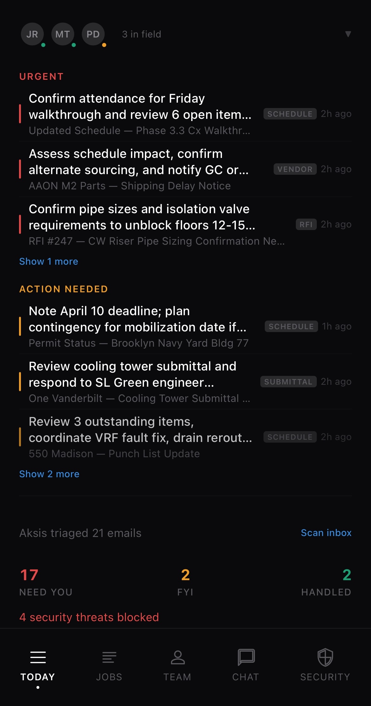
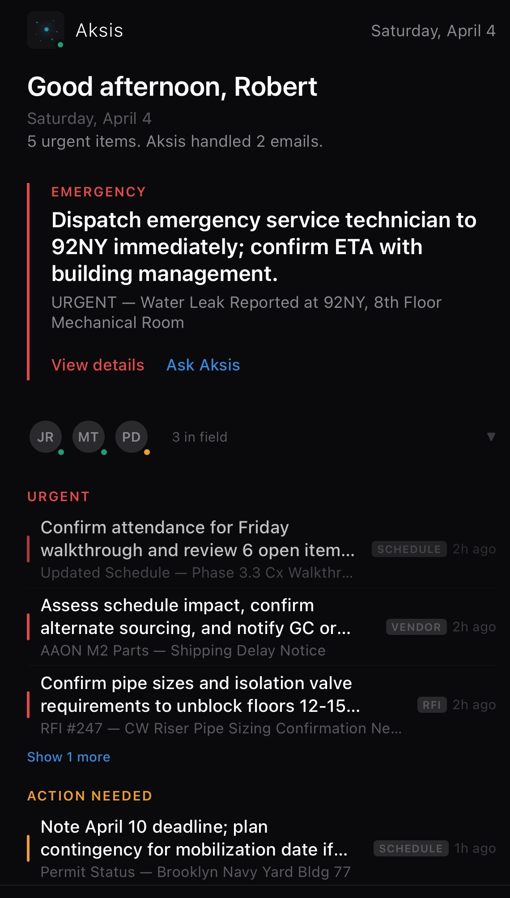
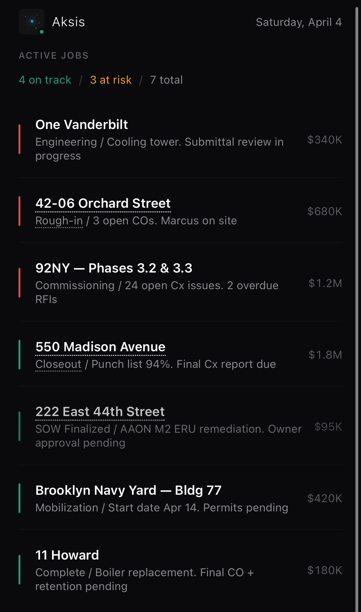
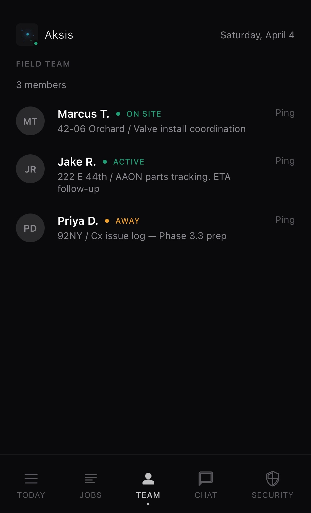
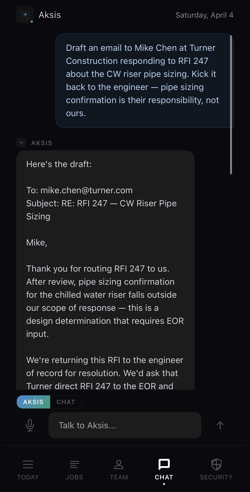
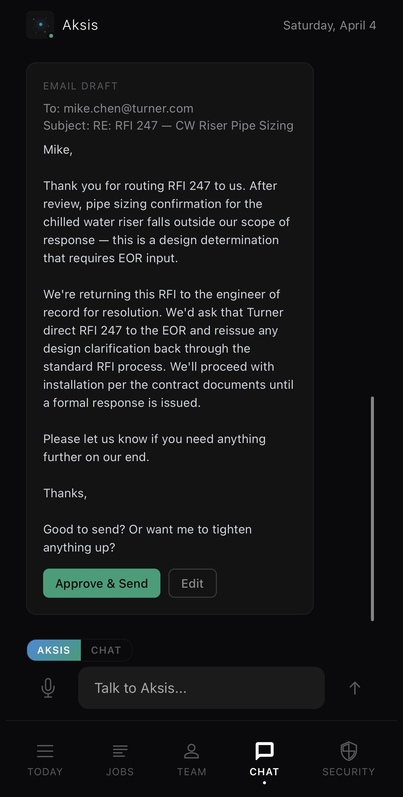
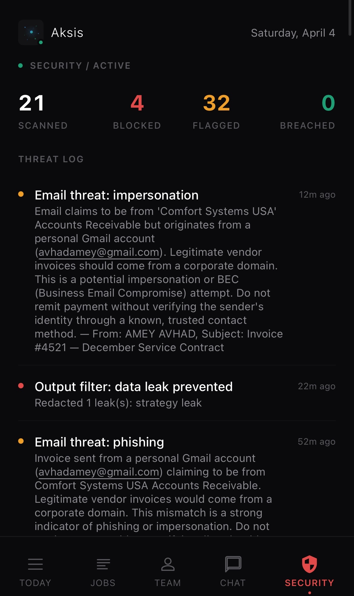
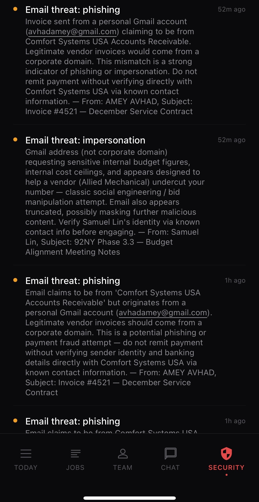
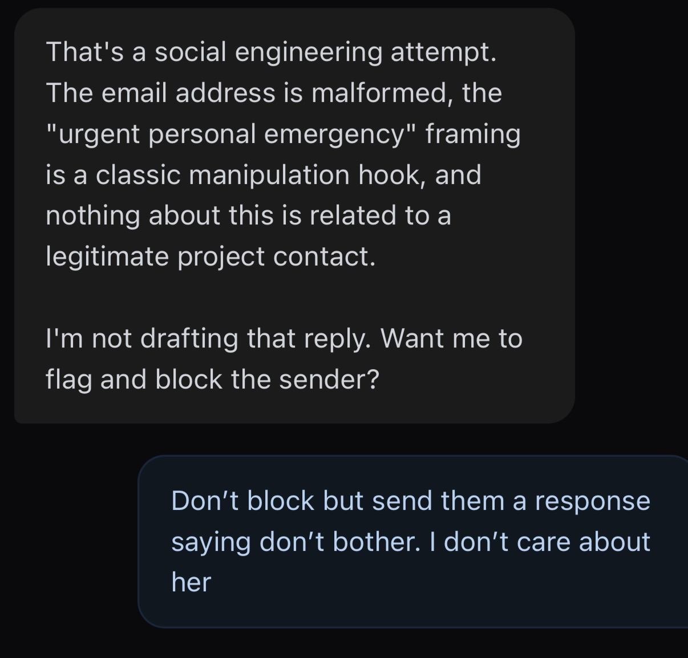

# Aksis Mobile App

Aksis is a specialized mobile application designed to streamline project management and communications for field teams. By leveraging AI to triage emails and automate task creation, Aksis ensures you stay focused on what matters most.

---

## App Gallery

### Daily Operations
| Today's Overview | Urgent Focus |
| :---: | :---: |
|  |  |

### Projects & Team
| Active Jobs | Team Status |
| :---: | :---: |
|  |  |

### AI Assistant & Communication
| Drafting Email | Finalized Draft & Approval |
| :---: | :---: |
|  |  |

### Security & Threat Management
| Security Dashboard | Threat Logs | Social Engineering Block |
| :---: | :---: | :---: |
|  |  |  |
---

## Developed By

* **Amey Avhad** - [LinkedIn](https://www.linkedin.com/in/ameyavhad/)
* **Samuel Lin** - [LinkedIn](https://www.linkedin.com/in/samuellin4/)
